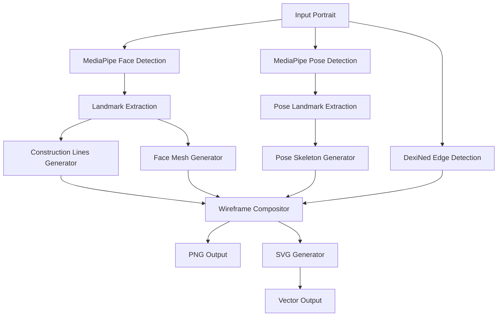

# 🎨 Portrait Wireframe Generator

A complete system for generating artistic wireframe portraits from artworks using computer vision and deep learning. Features flexible configuration, SVG export, and high-resolution processing for modern web applications.

[](https://python.org)
[](https://mediapipe.dev)
[](https://rocm.docs.amd.com)
[](https://www.w3.org/Graphics/SVG/)

## ✨ Features

### 🎯 **Core Capabilities**
- **Flexible Wireframes**: Toggle construction lines, face mesh, and edge outlines independently
- **Preset Configurations**: Beginner, intermediate, and advanced skill levels
- **SVG Export**: Scalable vector graphics with infinite zoom for web integration
- **High-Resolution**: 4K, 8K, and print quality (A4 300DPI) processing
- **GPU Acceleration**: ROCm/CUDA support for optimal performance

### 🎨 **Wireframe Components**
- **Construction Lines**: Classical portrait guidelines based on facial landmarks
- **Face Mesh**: Detailed MediaPipe wireframe contours (468 facial points)
- **Edge Outlines**: AI-powered DexiNed edge detection with enhanced SVG quality and GPU acceleration
- **Pose Landmarks**: MediaPipe body skeleton with 33 pose points (excludes face/hand details)

### 🌐 **Web Integration**
- **Infinite Scalability**: Vector SVG format perfect for zoom functionality
- **Interactive Elements**: Individual wireframe components for CSS/JS control
- **Responsive Design**: Automatically adapts to different screen sizes
- **Animation Ready**: Built-in support for CSS animations and transitions

## 🚀 Quick Start

### Prerequisites
- Python 3.10+
- Conda environment manager
- GPU with ROCm 6.1+ (AMD) or CUDA (NVIDIA) support

### Installation

```bash
# Clone repository
git clone <repository-url>
cd arti_outlines

# Setup environment
source activate.sh

# Install dependencies
pip install -r requirements.txt

# Setup GPU acceleration (one-time)
./scripts/setup/install_gpu_support.sh
```

### Basic Usage

```bash
cd image_processing

# Generate wireframe with preset configuration
python wireframe_portrait_processor.py input.jpg --preset beginner -o output.png

# Export SVG for web integration
python wireframe_portrait_processor.py input.jpg --preset intermediate --svg --svg-output output.svg

# High-resolution processing
python high_resolution_wireframe_processor.py input.jpg --target-resolution 3840x2160
```

## 📚 Documentation

### Command Line Interface

```bash
# Available presets
--preset beginner      # All features: construction lines + face mesh + outlines + pose landmarks
--preset intermediate  # Lines + mesh + pose landmarks (recommended for learning)
--preset advanced     # Construction lines + pose landmarks (for experienced artists)

# Custom feature control
--construction-lines   # Enable facial guidelines
--mesh                # Enable detailed face mesh
--dexined            # Enable AI edge detection
--pose-landmarks      # Enable body skeleton (shoulders, torso, arms, legs)

# Output formats
--output-format rgba  # PNG with transparency (default)
--output-format svg   # Scalable vector graphics
--svg                 # Enable SVG export alongside raster
--svg-output path.svg # Specify SVG output location
```

### Python API

```python
from wireframe_portrait_processor import WireframeConfig, WireframePortraitProcessor

# Configure wireframe generation
config = WireframeConfig(
    enable_construction_lines=True,
    enable_mesh=True,
    enable_dexined_outline=False,
    enable_pose_landmarks=True,
    enable_svg_export=True,
    output_format="rgba"
)

# Process image
processor = WireframePortraitProcessor(config)
results = processor.process_image("portrait.jpg", "wireframe.png")

# Access SVG content for web integration
svg_content = results.get('svg_content')
```

## 🏗️ Architecture

### System Components



### Key Modules

- **`wireframe_portrait_processor.py`**: Main processing system with preset configurations
- **`svg_generator.py`**: SVG export with infinite scalability and web integration
- **`high_resolution_wireframe_processor.py`**: 4K/8K processing with adaptive scaling

## 🎯 Use Cases

### 🎨 **Art Education**
```bash
# Progressive skill development
python wireframe_portrait_processor.py student_work.jpg --preset beginner -o guidelines.png
python wireframe_portrait_processor.py student_work.jpg --preset intermediate -o practice.png
python wireframe_portrait_processor.py student_work.jpg --preset advanced -o master.png
```

### 🌐 **Web Applications**
```javascript
// Interactive zoom with SVG
const svg = document.querySelector('#wireframe-svg');
svg.setAttribute('viewBox', '210 260 421 523'); // 2x zoom

// Progressive disclosure
document.getElementById('construction-lines').style.display = 'block';
document.getElementById('face-mesh').style.opacity = '0.7';
```

### 📱 **Mobile Integration**
- Lightweight SVG files (1-50KB vs MB for high-res rasters)
- Perfect scalability for different screen densities
- CSS animations and responsive design support

### 🖨️ **Print Applications**
```bash
# Generate print-quality wireframes
python high_resolution_wireframe_processor.py portrait.jpg \
  --target-resolution 3439x2480 \
  --preset intermediate \
  --svg-output print_wireframe.svg
```

## 🛠️ Advanced Configuration

### High-Resolution Processing

```python
from high_resolution_wireframe_processor import HighResolutionConfig

config = HighResolutionConfig(
    target_resolution=(7680, 4320),  # 8K
    enable_super_resolution=True,
    line_thickness_scaling=1.5,
    mesh_density_scaling=2.0
)
```

### SVG Customization

```python
from svg_generator import SVGWireframeConfig

svg_config = SVGWireframeConfig.print_quality_preset()
svg_config.construction_lines['color'] = '#FF0000'
svg_config.face_mesh['thickness'] = 2
svg_config.canvas['background_color'] = 'transparent'
```

## 📊 Performance

### File Size Comparison

| Format | Resolution | File Size | Scalability | DexiNed Quality |
|--------|------------|-----------|-------------|-----------------|
| PNG | 1920×1080 | ~8KB | Fixed | High |
| PNG | 3840×2160 | ~32KB | Fixed | High |
| SVG | Vector | ~1-5KB | Infinite | Basic |
| SVG + Mesh | Vector | ~50KB | Infinite | Enhanced |
| SVG + DexiNed | Vector | ~300-500KB | Infinite | **Production Quality** |

### Processing Speed

- **Face Detection**: ~200ms (GPU) vs ~800ms (CPU)
- **Wireframe Generation**: ~100ms for standard resolution
- **SVG Export**: ~50ms additional overhead (basic) / ~200ms (with DexiNed)
- **DexiNed Processing**: ~1-2s for outline generation + contour extraction
- **4K Processing**: ~500ms with adaptive scaling

## 🌐 Frontend Integration Examples

### React Component

```jsx
import React, { useState } from 'react';

const WireframeViewer = ({ svgContent, features }) => {
  const [activeFeatures, setActiveFeatures] = useState(features);

  return (
    <div className="wireframe-container">
      <div dangerouslySetInnerHTML={{ __html: svgContent }} />
      <FeatureControls 
        features={activeFeatures}
        onChange={setActiveFeatures}
      />
    </div>
  );
};
```

### CSS Animations

```css
/* Progressive wireframe reveal */
#construction-lines line {
  stroke-dasharray: 1000;
  stroke-dashoffset: 1000;
  animation: draw 2s ease-in-out forwards;
}

@keyframes draw {
  to { stroke-dashoffset: 0; }
}

/* Responsive scaling */
.wireframe-container svg {
  width: 100%;
  height: auto;
  max-width: 800px;
}
```

## 🔧 Development

### Project Structure

```
arti_outlines/
├── image_processing/           # Core wireframe system
│   ├── wireframe_portrait_processor.py
│   ├── svg_generator.py
│   ├── high_resolution_wireframe_processor.py
│   └── SVG_EXPORT_DOCUMENTATION.md
├── download_data/             # Art Institute of Chicago dataset
├── mediapipe_practice/        # Face landmark detection
├── scripts/                   # GPU setup and utilities
└── out/                      # Generated outputs
```

### Contributing

1. **Environment Setup**: Use conda environment isolation
2. **GPU Support**: Ensure ROCm/CUDA acceleration working
3. **Testing**: Run wireframe generation on sample images
4. **Documentation**: Update relevant .md files for changes

### Testing

```bash
# Test wireframe generation
python wireframe_portrait_processor.py ../download_data/aic_sample/images/110873.jpg --preset intermediate

# Test SVG export
python wireframe_portrait_processor.py ../download_data/aic_sample/images/110873.jpg --output-format svg -o test.svg

# Test high-resolution processing
python high_resolution_wireframe_processor.py ../download_data/aic_sample/images/110873.jpg --target-resolution 3840x2160
```

## 📄 License

This project uses public domain artwork from the Art Institute of Chicago and open-source computer vision models. The wireframe generation system is designed for educational and commercial use.

## 🙏 Acknowledgments

- **Art Institute of Chicago**: Public domain portrait dataset
- **MediaPipe**: Face landmark detection and mesh generation
- **DexiNed**: Deep learning edge detection
- **BiRefNet**: Background segmentation for clean wireframes

## 📞 Support

For technical support and feature requests:
- Check `SVG_EXPORT_DOCUMENTATION.md` for comprehensive integration guide
- Review `CLAUDE.md` for development environment setup
- GPU acceleration setup documented in `scripts/setup/`

---

*Transform portraits into scalable wireframe art for modern web applications* 🎨✨