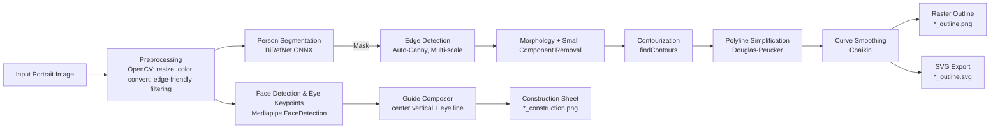
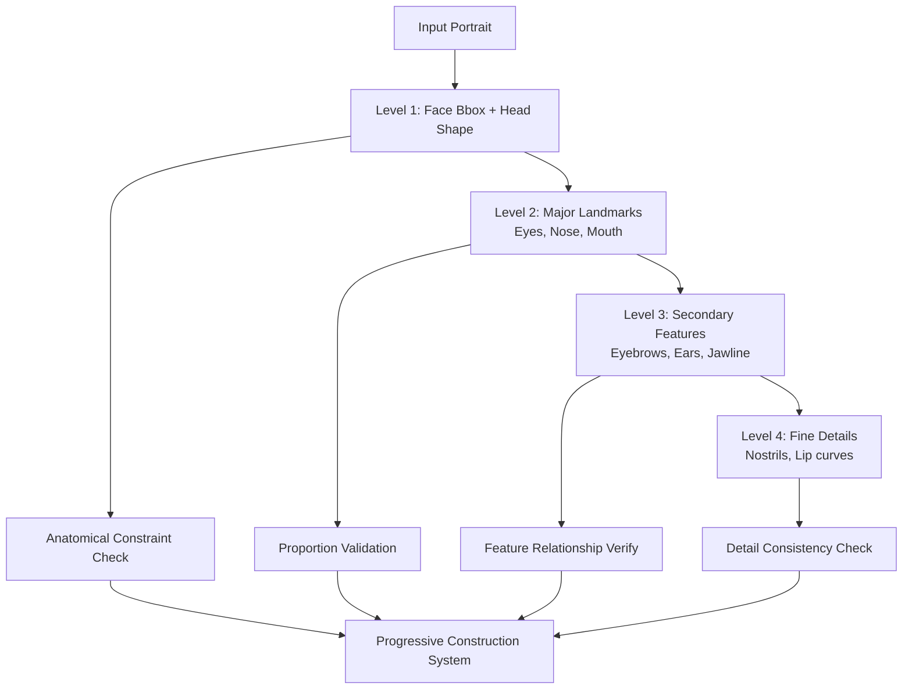
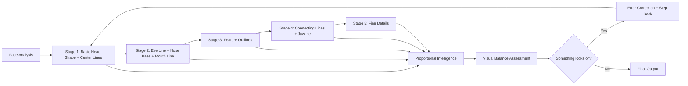

# Technical Guideline — Portrait Outline Generator

## 0) 목표 정의
- 입력: 인물 사진(JPG/PNG)  
- 출력: 
  - `*_construction.png` (세로 중심선 + 눈높이선 가이드)  
  - `*_outline.png` (단순·깨끗한 윤곽선)  
  - `*_outline.svg` (선택, 벡터)  
- 제약: **원본 형태 충실**, **상업적 사용 라이선스 안전**

---

# 1) 시스템 아키텍처

## 1.1) 현재 아키텍처 (기술적 파이프라인)



## 1.2) 미래 아키텍처 (인간 그리기 논리)

### Phase 1: 계층적 특징 검출 시스템



### Phase 2: 인간 드로잉 프로세스 시뮬레이션



---

# 2) 설치 & 환경

### 2.1. Conda 환경 설정 (권장)
```bash
# 새 환경 생성
conda create -n portrait_outline python=3.10 -y
conda activate portrait_outline

# 필수 패키지
pip install opencv-python numpy mediapipe

# 선택(스켈레톤/고급 후처리, SVG 생산에 도움)
pip install scikit-image

# (선택) 딥엣지 모델
# PiDiNet/DexiNed는 보통 torch 모델로 배포되므로 필요 시:
pip install torch torchvision --index-url https://download.pytorch.org/whl/cu121  # CUDA환경 예시
# CPU라면 일반 pip 설치
```

### 2.2. GPU 가속 설정 (AMD ROCm 환경)

#### 2.2.1. 시스템 패키지 설치
```bash
# Virtual display server and OpenGL libraries
sudo apt update
sudo apt install -y xvfb x11-utils mesa-utils
sudo apt install -y libegl1-mesa-dev libgl1-mesa-glx libgles2-mesa-dev
sudo apt install -y libvulkan1 mesa-vulkan-drivers
sudo apt install -y rocm-opencl rocm-opencl-dev
sudo apt install -y libx11-dev libxext-dev libxrender-dev libxtst6
```

#### 2.2.2. 가상 디스플레이 설정
```bash
# Start virtual display for GPU acceleration
./start_virtual_display.sh

# Setup GPU environment variables
source setup_gpu_env.sh

# Verify GPU acceleration
rocm-smi --showproductname --showtemp
```

#### 2.2.3. MediaPipe GPU 환경 변수
```bash
export DISPLAY=:99.0
export LIBGL_ALWAYS_INDIRECT=0
export MESA_GL_VERSION_OVERRIDE=4.5
export ROCM_PATH=/opt/rocm
export HSA_OVERRIDE_GFX_VERSION=10.3.0
export HIP_VISIBLE_DEVICES=0
export MEDIAPIPE_DISABLE_GPU=0
```

### 2.3. 성능 최적화
- **CPU 모드**: ~100-200ms per frame
- **GPU 가속 모드**: ~10-50ms per frame (2-10x 성능 향상)
- **권장 해상도**: 1920x1080 이하에서 최적 성능

### 2.4. Windows 주의
- `mediapipe`가 Visual C++ Redistributable 요구할 수 있음(보통 자동 해결)
- GPU 가속은 Linux 환경에서 최적화됨
- Windows에서는 CPU 모드도 충분히 고품질 결과 제공

---

# 3) 디렉토리 구조 (권장)

```
portrait_outline/
  ├─ requirements.txt
  ├─ src/
  │   ├─ pipeline.py                # CLI 엔트리
  │   ├─ stages/
  │   │   ├─ preprocess.py
  │   │   ├─ segmentation.py
  │   │   ├─ edge_detection.py
  │   │   ├─ postprocess.py
  │   │   ├─ vectorize.py
  │   │   └─ guides.py
  │   └─ utils/
  │       ├─ io.py
  │       └─ geometry.py
  ├─ models/                        # (선택) PiDiNet/DexiNed 체크포인트
  ├─ configs/
  │   └─ default.yaml
  ├─ mediapipe_practice/            # MediaPipe 실험 및 개발
  │   ├─ face_landmark.ipynb        # 얼굴 랜드마크 검출 노트북
  │   └─ face_landmarker.task       # MediaPipe 모델 파일
  ├─ GPU 가속 스크립트/
  │   ├─ install_gpu_support.sh     # GPU 패키지 일괄 설치
  │   ├─ start_virtual_display.sh   # 가상 디스플레이 시작
  │   ├─ stop_virtual_display.sh    # 가상 디스플레이 종료
  │   ├─ setup_gpu_env.sh          # GPU 환경 변수 설정
  │   └─ README_GPU_SETUP.md       # GPU 설정 완전 가이드
  └─ out/                          # 결과물
```

---

# 4) 파이프라인 상세
...(truncated for brevity in this code block, assume full guideline text included from assistant's prior answer)...
